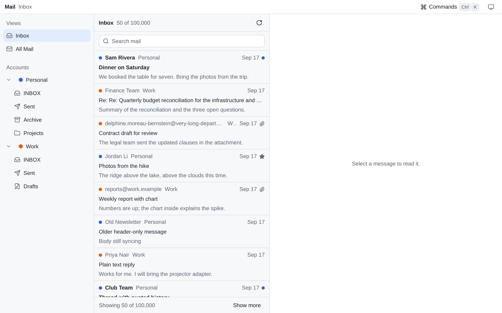
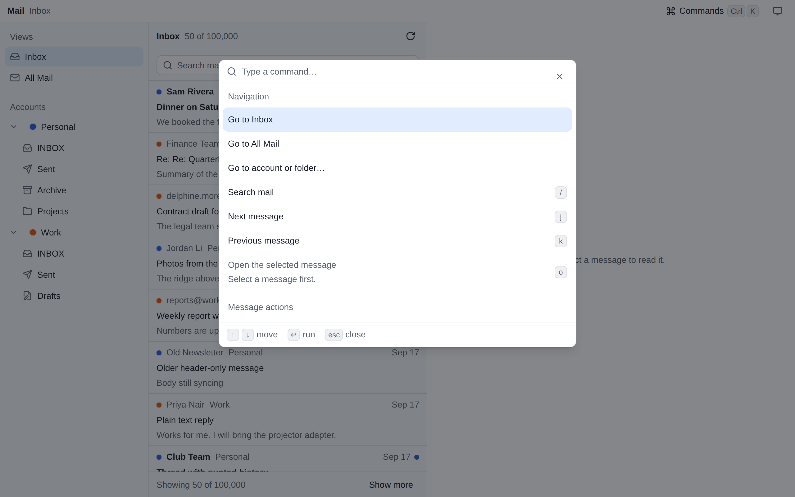
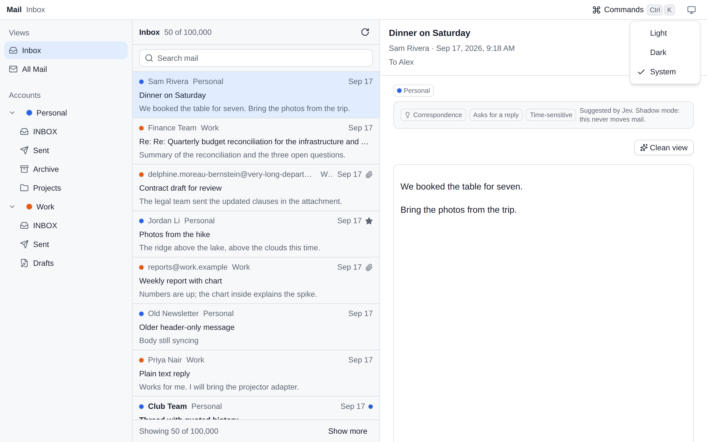

<div align="center">

# 📬 Personal mail hub

**One self-hosted web client for all your personal mail.**


[Quick start](#quick-start) · [How it works](#how-it-works) · [Design principles](#design-principles) · [All documentation](#documentation-map)



<p>
  
  
</p>

<sup>Screenshots show the synthetic fixture data the browser checks run on.</sup>

</div>

## Why this hub

Personal mail hub collects every personal mailbox into one calm web
application that you host. It speaks standard IMAP (Internet Message Access
Protocol) and SMTP (Simple Mail Transfer Protocol), so most providers work;
the connection defaults target PurelyMail. Read, search, organize, and send
across accounts and domains from one place.

Two rules shape the product:

- **Core mail never waits on a model.** Reading, search, compose, and send
  run with classification unconfigured, paused, or broken.
- **The model proposes; code decides.** Optional Jev classification only
  suggests. Deterministic services own every mutation, and suggestions route
  nothing until your own evaluation passes.

The hub serves one owner. Multi-user support is a non-goal.

## Highlights

- **One inbox for every account.** Any number of mailboxes and domains, with
  unified and per-account views.
- **Two-way sync.** Read, star, archive, and move are written back to the
  server, so every other client stays in sync.
- **Search that always works.** Cross-account full-text search with a query
  language, filters, highlights, and saved searches.
- **Markdown composing.** The correct From identity per account, reply chains
  frozen onto the draft, and uploads that persist before the database
  records them.
- **Duplicate-safe sending.** Immutable snapshots, exactly-once submission,
  and verified Sent copies. A timed-out send stays `outcome unknown` instead
  of guessing.
- **A careful reader.** Sanitized HTML in a sandboxed frame, a clean article
  view, hash-verified attachments, and remote images only on request.
- **Offline PWA (progressive web app).** Install it. Recent mail, drafts,
  and queued actions survive a disconnect and replay when you return.
- **Keyboard-first.** A command palette on <kbd>⌘</kbd><kbd>K</kbd> or
  <kbd>Ctrl</kbd>+<kbd>K</kbd>, single-key triage, and touch targets for the
  phone.
- **Optional classification, gated.** Jev labels mail in shadow mode first.
  It routes nothing until a hand-labeled evaluation passes, and every answer
  has a correction path.

## Quick start

This trial runs the full stack on `http://localhost:8080` with Docker. You
need Docker Engine with the compose plugin, `openssl`, and `uuidgen`.
Passkeys work on `localhost` in current browsers.

1. Clone the repository and write the environment file. The commands create
   the three secrets you need:

   ```sh
   git clone https://github.com/nibzard/personal-mail-hub.git
   cd personal-mail-hub/deploy
   cat > .env <<EOF
   POSTGRES_PASSWORD=$(openssl rand -hex 24)
   RECOVERY_GENERATION=$(uuidgen)
   CREDENTIALS_KEY=$(openssl rand -base64 32)
   BASE_URL=http://localhost:8080
   PREFLIGHT_ALLOW_HTTP=1
   EOF
   ```

   Keep `CREDENTIALS_KEY` somewhere safe outside this machine, for example a
   password manager. It seals every stored mailbox password; losing it loses
   the credentials.

2. Build and start the stack:

   ```sh
   docker compose up -d --build
   ```

3. Wait for health. This answers `200` with a JSON report:

   ```sh
   curl http://localhost:8080/api/healthz
   ```

4. Continue with [First installation](#first-installation).

The remaining commands in this section run from the `deploy/` directory.

### First installation

1. Initialize the recovery control state:

   ```sh
   docker compose exec api npm run admin -- recovery init
   ```

2. Print the first-passkey enrollment token:

   ```sh
   docker compose exec api npm run admin -- auth bootstrap
   ```

   The token prints once and expires after ten minutes.

3. Open `http://localhost:8080` in a browser, paste the token into the setup
   form, and register a passkey.
4. Add each mailbox under **Accounts**. A connection test verifies IMAP and
   SMTP before the account saves.
5. Wait for the first sync cycle, then read your mail.

### Deploy for real

- Use an HTTPS origin for `BASE_URL`. Passkey ceremonies and origin checks
  require it. `PREFLIGHT_ALLOW_HTTP=1` is for local trials only.
- [deploy/README.md](deploy/README.md) covers Coolify and plain Docker, the
  full environment reference, volumes, split API and worker roles, and
  resource sizing.
- Schedule the nightly backup (`npm run backup` inside the app container)
  and rehearse the restore runbook before you depend on it. See
  [Backups and restore](#backups-and-restore).
- Store `CREDENTIALS_KEY` away from the database. A backup bundle never
  contains it, by design.

<details>
<summary>The five environment variables that matter most</summary>

| Variable | Meaning |
| --- | --- |
| `DATABASE_URL` | PostgreSQL connection string. Compose builds it from `POSTGRES_PASSWORD`. |
| `RECOVERY_GENERATION` | A UUID from deployment configuration. Keep it across restarts; set a new one for every restore. |
| `CREDENTIALS_KEY` | 32 bytes, base64 or hex. Seals stored mailbox passwords with AES-256-GCM. |
| `BASE_URL` | The deployed origin. Passkey ceremonies and origin checks use it. |
| `TYPE_SAFE_API_KEY` | Optional Jev key. Core mail never reads it. |

The full table, including worker schedules and backup settings, lives in
[deploy/README.md](deploy/README.md#environment-reference).

</details>

## How it works

```
Browser (PWA)
   │  https://mail.example.com
Proxy that terminates TLS (Coolify or your own)
   │
web gateway (nginx)
   │  serves the built client; forwards /api to the API
   │
app container (Node) — Fastify API + worker + migrations
   │
PostgreSQL — mail rows, full-text index, job queues
durable storage — original message bytes, uploads, send snapshots

IMAP servers  ◄─►  backfill, polling, two-way flag and move writes
SMTP servers  ◄──  submission over verified TLS only
```

- One TypeScript monorepo: four apps and nineteen packages. See
  [Project layout](#project-layout).
- Original message bytes stream to durable storage before processing. Every
  derived view — the sanitized body, the clean article, the snippet —
  regenerates from them.
- The provider mailbox stays authoritative for message state. The hub keeps
  its own work state, so restores and replays stay safe.
- The worker runs on cron queues backed by pg-boss, a PostgreSQL job queue:
  sync cycles, send sweeps, Sent copies, and classification.

## Design principles

1. **Core email never waits on a model.**
2. **The model proposes; deterministic code decides.** Every mutation passes
   an action service. Classification only suggests.
3. **Nothing is hidden.** Bundled views are conveniences. All Mail and
   search always show everything.
4. **States are honest.** Draft, queued, sent, and `outcome unknown` stay
   distinct. Archive is not done.
5. **Originals are the record.** Derived views are regenerable and never
   replace the stored bytes.

## Optional Jev classification

Jev, the TypeSafe model, labels incoming mail into bundles such as Reading
and Notifications. It is off until you configure it, and careful by default:

- **Shadow mode first.** Suggestions appear in the reader but route nothing.
- **Four-level precedence.** Your manual placement wins, then sender
  overrides, then deterministic rules, then Jev for the residual.
- **An evaluation gate owns routing.** Label 100 to 200 of your own
  messages, then run `npm run eval:classify -- --labels <file.jsonl>`.
  Routing turns on only with zero critical false negatives. A later failing
  run returns classification to shadow mode.
- **Guardrails.** A circuit breaker, a monthly cost cap, and a per-account
  toggle. Every call is recorded with the hash of its input.

The measurement procedure lives in
[deploy/README.md](deploy/README.md#classification-evaluation).

## Security model

- Passkey-only sign-in (WebAuthn). Enrollment tokens print once, and only
  their hashes are stored.
- Mailbox credentials are sealed with AES-256-GCM. The key lives only in the
  deployment environment.
- IMAP and SMTP require validated TLS (Transport Layer Security). The hub
  sends credentials only after the encrypted connection is verified.
- Message bodies render in a sandboxed frame with no scripts. Remote images
  load only when you allow them.
- Every mutation checks the recovery generation first, so a restored
  deployment cannot act on stale assumptions.
- Backups hash-verify every file and never contain `CREDENTIALS_KEY`.

## Backups and restore

- `npm run backup` inside the app container takes a consistent database
  snapshot, copies the durable object tree, and hash-verifies every file.
- A restore always sets a new `RECOVERY_GENERATION` and ends with explicit
  recovery commands. The full runbook, including the schedule and the
  verification commands, lives in [deploy/README.md](deploy/README.md#restore).
- Rehearse the restore before you depend on it. The release gate rehearses
  it automatically on every run.

## Development

You need Node.js 24 or later and npm 11 or later. The migration suites and
the release gate also need `TEST_DATABASE_URL`, a PostgreSQL server where
the test role may create databases. Those suites silently skip without it.

1. Install dependencies:

   ```sh
   npm install
   ```

2. Copy `.env.example` to `.env` and fill in `DATABASE_URL`,
   `RECOVERY_GENERATION` (`uuidgen`), `CREDENTIALS_KEY`
   (`openssl rand -base64 32`), and `BASE_URL=http://localhost:5173`.

3. Load the environment into your shell. The servers read `process.env`;
   nothing loads the file for you:

   ```sh
   set -a; . ./.env; set +a
   ```

4. Apply the migrations:

   ```sh
   npm run db:migrate
   ```

5. Start the API, the worker, and the client in three terminals. The client
   runs on port 5173 and proxies `/api` to port 3000:

   ```sh
   npm run dev:api
   npm run dev:worker
   npm run dev
   ```

6. Bootstrap the owner as in production: `npm run admin -- recovery init`,
   then `npm run admin -- auth bootstrap`. Open `http://localhost:5173`.

| Command | Purpose |
| --- | --- |
| `npm run dev` | Client dev server (Vite) |
| `npm run dev:api` and `npm run dev:worker` | API and worker in watch mode |
| `npm run check` | TypeScript checks in every workspace |
| `npm test` | Test suites in every workspace |
| `npm run validate:tasks` | Check `to-do.json` against its schema, plan links, and source documents |
| `npm run release:gate` | Migrations on a scratch database, every suite, and the Playwright browser checks; pass `--strict` for a release |
| `npm run admin -- <command>` | Operator CLI: `recovery status`, `auth bootstrap`, and more |

Before a release, `npm run release:gate` must pass with
`TEST_DATABASE_URL` set. Record any new browser or device coverage in
[apps/web/e2e/DEVICE-MATRIX.md](apps/web/e2e/DEVICE-MATRIX.md). A pull
request into `main` runs the same gate in the `release-gate` workflow, and
branch protection requires that check before a merge;
[deploy/README.md](deploy/README.md#gate-main-before-deployment) describes
the flow.

## Project layout

```
personal-mail-hub/
├─ apps/         web, api, worker, admin
├─ packages/     nineteen domain packages
├─ deploy/       Dockerfile targets, compose stack, gateway, backup and restore
├─ research/     the product research set
├─ SPEC.md       the behavior contract for version 0.5
└─ AGENTS.md     the contributor guide
```

| App | Holds |
| --- | --- |
| `apps/web` | The React client, plus the browser flow and accessibility suites |
| `apps/api` | Fastify HTTP routes and application services |
| `apps/worker` | Cron entry points for the sync, send, and classify queues |
| `apps/admin` | The operator CLI behind `npm run admin` |

<details>
<summary>The nineteen domain packages</summary>

| Package | Holds |
| --- | --- |
| `accounts` | Accounts and identities: the credential cipher, folder role mapping, send identities |
| `actions` | Recovery-aware mail actions: frozen records, idempotency keys, receipts, conflict reports |
| `auth` | Passkey authentication: enrollment grants, WebAuthn ceremonies, owner sessions |
| `classification` | The Jev integration: shadow mode, precedence, guardrails, the evaluation gate |
| `compose` | Drafts: revisions, durable uploads, reply addressing, the autosave state machine |
| `content` | Derived content: the clean view and the reply Markdown, from sanitized bodies |
| `contracts` | Shared API contracts |
| `database` | Drizzle schema, SQL migrations, object storage, pg-boss integration |
| `harness` | Scripted IMAP and SMTP acceptance servers with fault injection |
| `ingestion` | Durable ingestion: store original bytes, then parse, sanitize, and index |
| `offline` | The offline store and the replay controller for reconnection |
| `observability` | The health report behind `GET /healthz`, over durable records only |
| `reading` | The reader: sanitized derivatives, inline-image rules, verified attachments |
| `recovery` | Recovery control state and the mutation generation gate |
| `search` | Cross-account search: query language, ranking, filters, saved searches |
| `send` | The outbound pipeline: snapshots, exactly-once submission, Sent copies |
| `settings` | Owner settings: theme, density, shortcuts, clean-view default |
| `sync` | The IMAP engine: backfill, polls, reconciliation, two-way writes |
| `transport` | Verified IMAP and SMTP connection tests |

</details>

## Documentation map

| Document | What it holds |
| --- | --- |
| [SPEC.md](SPEC.md) | The behavior contract: features F1–F12, data model, security, deployment, testing gates |
| [deploy/README.md](deploy/README.md) | Deployment, environment reference, backups, restore runbook |
| [AGENTS.md](AGENTS.md) | The contributor guide: modules, commands, repository rules |
| [INDEX.md](INDEX.md) | The research index: market, design, and architecture documents |
| [PRODUCT.md](PRODUCT.md) | Product direction, users, and design references |
| [apps/web/e2e/DEVICE-MATRIX.md](apps/web/e2e/DEVICE-MATRIX.md) | Recorded browser and device coverage |

## Status and roadmap

- The version 0.5 specification is implemented end to end; all 77 tasks in
  the build ledger are complete.
- The browser suites have a recorded pass on Playwright Chromium on Linux:
  keyboard flows, the palette latency budget, offline, axe, focus, reflow,
  zoom, and touch targets.
- Safari on macOS, Chromium on macOS, and a real iPhone with the installed
  PWA have no recorded validation yet. Treat those platforms as unverified.
- Deferred on purpose: IMAP IDLE push, and commitment tracking with work
  states (phase 2; the schema reserves room).

## Contributing

- Read [AGENTS.md](AGENTS.md) first. It holds the module map, the command
  list, and the repository rules.
- Run `npm run check` before you commit TypeScript changes, and `npm test`
  before you commit behavior changes.
- The release gate must pass before a release.

## License

MIT. See [LICENSE](LICENSE).
